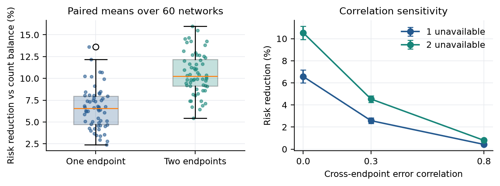

# Contingent Exposure Routing for Financial AI

**Shivam Gupta · Independent Researcher · September 2026**

Research code and manuscript for **Contingent Exposure Routing for Financial AI: Outage Risk and the Cost of Indivisible Decisions**.

When financial applications switch model endpoints during an outage, request availability can remain unchanged while financial exposure becomes concentrated. This project models that change, accounts for the difference between fractional allocation and selecting one endpoint per institution, and implements exposure-aware fallback assignment.



## Paper and evidence

- [Manuscript PDF](output/pdf/Gupta_Contingent_Exposure_Routing.pdf) and [LaTeX source](paper/main.tex).
- 60 synthetic portfolio networks; 11,340 deterministic scenario evaluations.
- 1,024 recorded API observations on 256 constructed rebalancing tasks; 128 calibration and 128 held-out tasks.
- 16 separately recorded post-collection arithmetic diagnostics.
- 48 automated checks, including exhaustive assignments, accounting identities, cascade checks, and lower-bound comparisons.
- Six reproducible figures, three manuscript tables, and a [literature/novelty audit](notes/literature-audit.md).

The work targets the contributed-lecture program at SIAM FM27. No conference acceptance, journal peer review, or arXiv identifier is claimed. Submission state is recorded in [submission/status.md](submission/status.md).

## Results in context

With independent errors and feedback radius 0.4, the quota-preserving procedure reduces the quadratic price-displacement measure by 6.57% for one endpoint removal and 10.53% for two, while preserving each endpoint's request count. The recorded-error replay gives a 3.30% held-out reduction (paired task bootstrap interval 2.07–4.57%).

Common errors reduce the benefit. A common-best endpoint policy can outperform diversification when quality differs, although its request counts differ. The arithmetic models perform poorly on this workload and are dominated by an exact deterministic solver. The replay is a controlled error-panel experiment, not a model capability ranking or evidence of real-market crash reduction. Financial networks and impact coefficients are synthetic; all tested API endpoints use one vendor.

## Quick start

Python 3.12 was used for the recorded run. No API key is needed for the demo or offline reproduction.

```bash
python3 -m venv .venv
source .venv/bin/activate
python -m pip install -r requirements-lock.txt
python scripts/demo.py --outage 0 1 --output results/demo.json
python -m pytest -q
```

The demo returns an actual route for each institution, preserved endpoint counts, before/after risk, a numerical lower bound, and the remaining gap. It makes no market connection and sends no orders.

To reproduce all numerical results and figures:

```bash
bash scripts/reproduce.sh
```

If [Tectonic](https://tectonic-typesetting.github.io/) is installed, this also rebuilds the manuscript. Alternatively, compile `paper/main.tex` with a standard LaTeX/BibTeX workflow supporting `newtxtext` and `newtxmath`. The manuscript uses standard packages and vector PDF figures.

## What the code guarantees

Let `A` be the asset-by-institution financial response matrix, `Q` a fractional routing matrix, and `S` the uncentered endpoint error second moment. Fractional risk is `trace(A Q S Q.T A.T)`. Independent single-endpoint selection adds

```text
sum_i ||A[:,i]||^2 * (diag(S) @ Q[i] - Q[i] @ S @ Q[i])
```

`conditional_round` derandomizes this exact expectation under row-wise eligibility constraints. It does not preserve coupled quotas. `quota_swaps` preserves endpoint counts and monotonically improves the specified objective; it is a local-search heuristic. `fractional_optimum` returns a supporting-hyperplane dual lower bound, rather than treating a feasible primal objective as a lower bound. All numerical certificates use floating-point arithmetic.

## Repository map

| Path | Contents |
|---|---|
| `src/cer/` | Risk formulas, network generator, routing, exact task ground truth |
| `tests/` | Independent small-instance and mathematical checks |
| `config/protocol.json` | Local plan frozen before collection; not externally preregistered |
| `data/raw/` | Prompts, raw response records, timestamps, identifiers and diagnostics |
| `data/processed/` | Error panel, calibration split, fitted moments |
| `results/` | Complete scenario tables, paired task losses, intervals, demo routes |
| `figures/` | Generated vector PDFs and PNG previews |
| `paper/` | Manuscript, bibliography and generated table rows |
| `submission/` | FM27 abstract, metadata, presentation outline and submission status |
| `notes/` | Literature audit, research plan and review notes |

## Optional new API collection

The archived response file is sufficient for reproduction. A remote rerun can differ even with pinned model identifiers and temperature zero. To collect new observations, use a **separate clone** and intentionally move the archived response file out of `data/raw/`; the collector resumes existing records and never silently overwrites them.

```bash
python scripts/collect_api.py --execute
```

The script prompts for a key without echo, or reads `OPENAI_API_KEY`. Credentials are not saved. Collection has a declared request limit and a $15 estimated-cost guard. The primary recorded run used 1,025 HTTP requests including one retry and approximately $0.2143 of nominal token charges. The 16 diagnostic requests are separate. Prices are estimates, not billing statements.

## Reproducibility and scope

The synthetic statistics average removal scenarios within each independent network before bootstrapping networks. API inference resamples held-out tasks with endpoint responses paired and policies fixed. These are different estimands. Secondary comparisons and tail checks are identified as exploratory or diagnostic. The repository does not claim empirical market calibration, patentability, production readiness, or that a scoped literature search proves universal novelty.

Code is MIT licensed. The manuscript and constructed research data may be shared under CC BY 4.0; third-party papers are not redistributed. See [CITATION.cff](CITATION.cff) for citation metadata.
